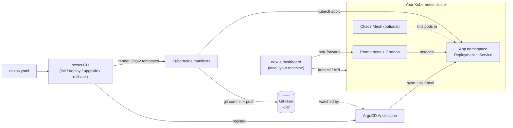

# Nexus

> **Bring your app. Nexus handles the platform.**

📖 **[Documentation](https://kelyonn.github.io/nexus/)** · Apache-2.0 · Python 3.10+ ·
607 tests, 99% core coverage · not yet on PyPI — install from source below

## What is Nexus

Nexus is an open-source GitOps platform CLI. Point it at any containerized
app, fill in one config file (`nexus.yaml`), run one command
(`nexus deploy`), and get production-grade Kubernetes infrastructure —
GitOps deployment, self-healing, observability, and optional chaos
testing — on your own cluster, in minutes, without a dedicated DevOps team.

It's built for developers who want their app running on real Kubernetes
infrastructure without first becoming a Kubernetes expert: Nexus generates
every manifest, wires up ArgoCD, Prometheus, Grafana, and (optionally)
Chaos Mesh, and gets out of the way — the underlying tools stay standard,
inspectable Kubernetes objects, not a black box.

- **GitOps deployment** via [ArgoCD](https://argo-cd.readthedocs.io/) — your
  cluster's state is always driven from a git commit, never a one-off
  `kubectl apply` no one can reproduce.
- **Self-healing** — Kubernetes' own Deployment controller replaces a pod
  the moment it dies, and ArgoCD reverts anything that drifts from what's
  committed in git. Both are always on, independent of Nexus itself.
- **Observability** via [Prometheus](https://prometheus.io/) +
  [Grafana](https://grafana.com/) — one consolidated per-app dashboard,
  plus live CPU/memory/replica/restart sparklines in `nexus dashboard`.
- **Chaos testing** via [Chaos Mesh](https://chaos-mesh.org/) (optional) —
  kill a pod on purpose, on demand or on a schedule, and confirm the
  self-healing layer above actually catches it.

All on your own cluster — no DevOps team required.

## Architecture



`nexus deploy` never talks to the Kubernetes API directly for anything
complex — it shells out to `kubectl`/`helm`, renders manifests from
`nexus.yaml` via Jinja2, commits them to git, and registers an ArgoCD
`Application`. From there, ArgoCD owns reconciliation: it's what actually
applies drift correction and keeps the cluster matching git, not Nexus.
`nexus dashboard` is a separate, local-only read layer — it never mutates
cluster state except through the same one-click chaos trigger `nexus chaos
run` uses. Full breakdown, including the repository layout and how each
Jinja2 template maps to a `legacy/` reference manifest, in
[Architecture](https://kelyonn.github.io/nexus/architecture/).

## What it looks like

```
$ nexus deploy

  Nexus Deploy — nexus-app
  -------------------------------------------
  ✓ kubectl found (v1.36.2)
  ✓ helm found (v4.2.3)
  ✓ Cluster reachable -> minikube
  ✗ ArgoCD not installed → will install
  ✗ kube-prometheus-stack not installed → will install

  Deployment plan:
    1. Install ArgoCD → namespace: argocd
    2. Install kube-prometheus-stack → namespace: monitoring
    3. Apply app manifests → namespace: nexus-app
    4. Commit manifests to Git → k8s/
    5. Register ArgoCD app → tracking your repo @ main

  Proceed? [y/N]: y
  ...
  ✓ nexus-app is live
```

That's real, captured output — not a mockup. [Try it yourself](#try-it) below.

## Try it

Requires Python 3.10+, Docker, and [Minikube](https://minikube.sigs.k8s.io/)
(or [Kind](https://kind.sigs.k8s.io/)).

```bash
git clone https://github.com/kelyonn/nexus.git && cd nexus

python3 -m venv venv && source venv/bin/activate
pip install -e ".[dev]"

minikube start --driver=docker

cd examples/flask-demo
nexus deploy      # installs ArgoCD + monitoring, deploys the app — type y
nexus status        # replicas, pods, ArgoCD sync/health
nexus open           # port-forwards the app and opens it in your browser, Ctrl+C to stop
nexus watch          # live pod events, Ctrl+C to stop
nexus logs            # tail every pod's logs, prefixed by pod name
nexus chaos run        # kill one pod, watch it recover
nexus doctor             # environment diagnostics — every problem, with a fix
nexus destroy              # type the app name to confirm
```

`nexus deploy` never opens the app for you — it's a one-shot, idempotent
command, and a background tunnel left running after it exits would collide
with your next `nexus deploy`. `nexus open` is the dedicated way to view it
(on Minikube, `minikube service <app-name> -n <app-name>` also works and
skips the extra command). See
[Exposing your app](https://kelyonn.github.io/nexus/exposing-your-app/) for
the other options (`serviceType`, your own Ingress).

`nexus deploy` is idempotent — safe to run more than once. `nexus upgrade
--image <tag>` and `nexus rollback` also exist but need a real git remote
(see [INSTALLATION.md](INSTALLATION.md) to try those).

### The dashboard

```bash
pip install -e ".[dashboard]"   # fastapi/uvicorn — not in the base install
nexus dashboard                  # opens the browser, Ctrl+C to stop
```

A local control panel: an app grid, live CPU/memory/replica/restart
sparklines, a chaos-trigger button with a recovery indicator, and a GitOps
sync log with real commit messages. Grafana isn't embedded — an iframe
pointed at an unauthenticated Grafana just silently shows its login form —
so "Open Grafana ↗" is a plain link straight to the app's one consolidated
dashboard, and `nexus dashboard` prints the admin login right when it
forwards Grafana so that click isn't a dead end. No Node/npm needed at
install time — the frontend ships as a static export baked into the
package (a checkout needs one `npm run build` in
[dashboard/frontend](dashboard/frontend) first; see that directory's README).
Needs at least one app deployed to show anything.

## Command reference

| Command | What it does |
|---|---|
| `nexus init` | Detect your app's stack, generate a pre-filled `nexus.yaml` |
| `nexus deploy` | Install missing platform components, apply manifests, sync to git, register with ArgoCD |
| `nexus status` | Replicas, ArgoCD sync/health, pod status |
| `nexus open` | Port-forward the app and open it in your browser, until Ctrl+C |
| `nexus watch` | Stream pod lifecycle events until Ctrl+C |
| `nexus logs` | Tail every pod's logs, prefixed by pod name (`--follow` to stream) |
| `nexus doctor` | Environment diagnostics — every problem, with a fix |
| `nexus upgrade --image` | Bump the app's image, commit/push, roll out via ArgoCD |
| `nexus rollback` | Revert the image through git (never ArgoCD's own rollback, which self-heal would undo) |
| `nexus destroy` | Remove the app's namespace, ArgoCD app, and monitoring resources (typed-name confirmation) |
| `nexus chaos run` / `chaos schedule` | One-shot or recurring pod-kill experiments via Chaos Mesh |
| `nexus dashboard` | Launch the local control panel |

Every flag, straight from `--help`: [Command reference](https://kelyonn.github.io/nexus/commands/).

## Documentation

Full docs, including everything above in more depth:
**<https://kelyonn.github.io/nexus/>**

| Page | What's in it |
|---|---|
| [Install & quickstart](https://kelyonn.github.io/nexus/install/) | A real app on Minikube or Kind in under ten minutes |
| [Command reference](https://kelyonn.github.io/nexus/commands/) | Every command and flag, straight from `--help` |
| [nexus.yaml schema](https://kelyonn.github.io/nexus/schema/) | Every field, its type, default, and validation rule |
| [Architecture](https://kelyonn.github.io/nexus/architecture/) | How the CLI, manifests, ArgoCD, and dashboard fit together |
| [Exposing your app](https://kelyonn.github.io/nexus/exposing-your-app/) | Port-forward, `serviceType`, or bring your own Ingress |
| [Multiple environments](https://kelyonn.github.io/nexus/multi-environment/) | Staging and prod from separate `nexus.yaml` files |
| [Troubleshooting](https://kelyonn.github.io/nexus/troubleshooting/) | Real problems hit during development, and their fixes |
| [Cloud quick-starts](https://kelyonn.github.io/nexus/cloud/) | EKS/GKE/AKS notes (⚠️ not yet verified against real cloud clusters) |

Built from [docs_site/](docs_site) with MkDocs Material, deployed to GitHub
Pages on every push to `main` that touches the site — see
[CONTRIBUTING.md](CONTRIBUTING.md#before-opening-a-pr) to work on it locally.

## Contributing

PRs welcome — see [CONTRIBUTING.md](CONTRIBUTING.md) for setup, the pre-PR
gate, and this project's scope boundaries. Fresh-install notes:
[INSTALLATION.md](INSTALLATION.md). Bigger ideas that are real but
deliberately not started yet are tracked in
[FUTURE-SCOPE.md](FUTURE-SCOPE.md), with the design questions each one needs
answered first.

## License

Apache-2.0.
